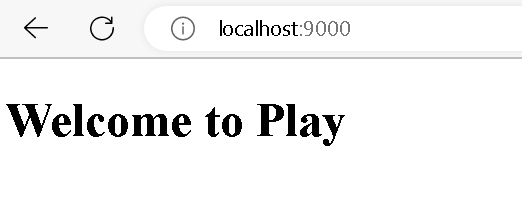

# Overview
This project aims to describe a simple code of a web MVC with Play framework and Scala

# Prerequisite
1. Java SE: 8-11
2. sbt: latest version

## Verifying Java Version
Pay 2.8.x requires Java 8 to 11.
```bash
java -version
```
The output of above commandline looks like:
```
openjdk version "11.0.17" 2022-10-18
OpenJDK Runtime Environment (build 11.0.17+8-post-Ubuntu-1ubuntu220.04)
OpenJDK 64-Bit Server VM (build 11.0.17+8-post-Ubuntu-1ubuntu220.04, mixed mode)
```

## Installing & Verifying sbt
1. Follow the below instruction to install sbt [sbt]([https://](https://www.scala-sbt.org/download.html))
2. Verify sbt
    ```bash
    sbt --version
    ```
The output looks like: 
```
sbt version in this project: 1.7.2
sbt script version: 1.8.2
```


# Technology Stack
| Name            | Version | Description                                    |
|-----------------|:-------:|------------------------------------------------|
| Scala           |  2.13.10| Scala programming Language                     |
| Play Framework  |  2.8.19 | The reactive framework for web development     |
| Scala Sbt       |  1.7.2  | The scala build tool and dependency management |
| ScalaTesting    |         | The source code testing framework for Scala    |
| Giter8          |         | Giter8 is a command line tool to generate files and directories from templates published on GitHub or any other git repository.                   |

# Code Structure
This project is generated from project template(Giter8) which is the Anatomy of a Play application.

You can easily use the follow commandine to generate new project: 
```bash
sbt new playframework/play-scala-seed.g8

```
And then you got:
```
app                      → Application sources
 └ assets                → Compiled asset sources
    └ stylesheets        → Typically LESS CSS sources
    └ javascripts        → Typically CoffeeScript sources
 └ controllers           → Application controllers
 └ models                → Application business layer
 └ views                 → Templates
build.sbt                → Application build script
conf                     → Configurations files and other non-compiled resources (on classpath)
 └ application.conf      → Main configuration file
 └ routes                → Routes definition
dist                     → Arbitrary files to be included in your projects distribution
public                   → Public assets
 └ stylesheets           → CSS files
 └ javascripts           → Javascript files
 └ images                → Image files
project                  → sbt configuration files
 └ build.properties      → Marker for sbt project
 └ plugins.sbt           → sbt plugins including the declaration for Play itself
lib                      → Unmanaged libraries dependencies
logs                     → Logs folder
 └ application.log       → Default log file
target                   → Generated stuff
 └ resolution-cache      → Info about dependencies
 └ scala-2.13
    └ api                → Generated API docs
    └ classes            → Compiled class files
    └ routes             → Sources generated from routes
    └ twirl              → Sources generated from templates
 └ universal             → Application packaging
 └ web                   → Compiled web assets
test                     → source folder for unit or functional tests
```
For more info: [Anatomy](https://www.playframework.com/documentation/2.8.x/Anatomy)

# How to use scala with sbt tool
## Run the code
```bash
sbt run
```
You got the following log info in the commandline
```
[info] welcome to sbt 1.7.2 (Ubuntu Java 11.0.17)
[info] loading settings for project scala-demo-build from plugins.sbt ...
[info] loading project definition from /mnt/d/Source/scala/scala-demo/project
[info] loading settings for project root from build.sbt ...
[info]   __              __
[info]   \ \     ____   / /____ _ __  __
[info]    \ \   / __ \ / // __ `// / / /
[info]    / /  / /_/ // // /_/ // /_/ /
[info]   /_/  / .___//_/ \__,_/ \__, /
[info]       /_/               /____/
[info]
[info] Version 2.8.19 running Java 11.0.17
[info]
[info] Play is run entirely by the community. Please consider contributing and/or donating:
[info] https://www.playframework.com/sponsors
[info]
[info] sbt server started at local:///home/loinx/.sbt/1.0/server/5ee36ecd8659ee744699/sock
[info] started sbt server

--- (Running the application, auto-reloading is enabled) ---

[info] p.c.s.AkkaHttpServer - Listening for HTTP on /0:0:0:0:0:0:0:0:9000

(Server started, use Enter to stop and go back to the console...)

```
So now you are able to access the page at link: http://localhost:9000

## Run test
```bash
sbt test
```
# Unit Test
TODO


# References
1. https://www.playframework.com/getting-started
2. https://www.scala-sbt.org/download.html
3. https://docs.scala-lang.org/scala3/book/tools-sbt.html
4. https://github.com/foundweekends/giter8
